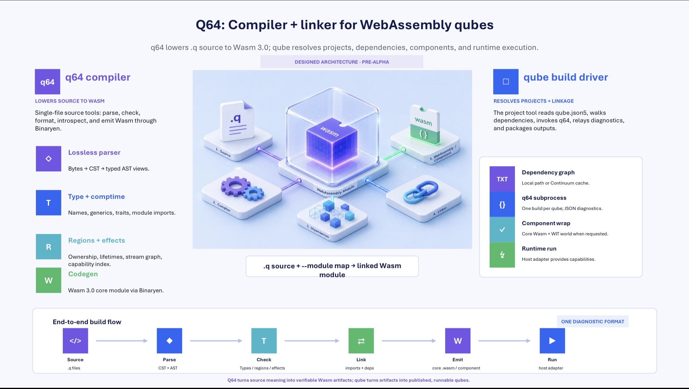

# Architecture — the q64 compiler and linker

How a `.q` source file becomes a running WebAssembly program, and how
separately-published qubes are linked together along the way.

This document describes the **designed** architecture — the pipeline as the
[spec](./spec) defines it. It is the map; the spec is the territory. When this
doc and the spec disagree, the spec wins (see [`CLAUDE.md`](./CLAUDE.md)).

> **Status: pre-alpha.** Several stages described below are specified and
> scaffolded but not yet fully implemented. This doc covers the intended
> architecture rather than auditing what is wired up on any given day.



The diagram above is the one-page map this document walks through. The two
panels are the two binaries: the **q64 compiler** on the left lowers a single
`.q` source file to a Wasm 3.0 module through its passes (lossless parser →
type + comptime → regions + effects → codegen), and the **qube build driver**
on the right resolves a project — dependency graph, `q64` subprocess
invocations, optional component wrap, and runtime execution. They meet in the
middle at the linker: `.q source + --module map → linked Wasm module`. The
strip along the bottom is the end-to-end build flow — **Source → Parse → Check
→ Link → Emit → Run** — all carried over a single diagnostic format. Each piece
is expanded in the sections below.

## The two-binary split

Q64 ships two command-line tools, and the division of labor mirrors
`rustc` + `cargo`:

| Binary | Operates on | Analogy | Reference |
|--------|-------------|---------|-----------|
| `q64`  | q64 *source* — single files, the language server, formatting, introspection | `rustc` | [`spec/q64-cli.md`](./spec/q64-cli.md) |
| `qube` | qube *projects* — a directory with a `qube.json5` manifest, its dependencies, and its build outputs | `cargo` | [`spec/qube-cli.md`](./spec/qube-cli.md) |

`qube build` invokes `q64` internally, once per source file, the same way
`cargo build` invokes `rustc`. `q64` never reads `qube.json5`; `qube` never
parses q64 source. The contract between them is a small set of command-line
flags (chiefly `--module`) and a newline-delimited JSON diagnostic stream.

Both binaries are written in **Zig**, chosen for clean Binaryen C-API interop,
strong cross-compilation, and tiny static binaries with no LLVM dependency
(see [`README.md`](./README.md) §"Implementation languages").

### Vocabulary

The casing carries meaning (full table in [`CLAUDE.md`](./CLAUDE.md)):

- **qube** — the unit of distribution: what you publish, depend on, and
  import. A *library* qube exports a surface and is linked into others.
- **Qube** — a *deployment-artifact* qube (`type: "application"`, has a
  `main`, runnable).
- **Continuum** — the qube registry, where qubes live.
- `q64` / `qube` — the two CLI tools (monospace, lowercase).

### The build target

A qube compiles to a **Wasm 3.0 core module**. On request it is additionally
wrapped in a WebAssembly **component** whose interface is a WIT world — see
[Linking into a component](#5-linking-into-a-component) below. The core module
is always the primary artifact; the component embeds it.

---

## 1. The compiler (`q64`): the pipeline

`q64` lowers source to wasm through a sequence of passes. Each pass owns a
slice of meaning, emits its own family of diagnostic codes, and hands a
refined representation to the next:

```
            .q source bytes
                 │
          ┌──────▼──────┐
          │   parser    │  bytes → lossless CST → typed AST views    (LEX*, PAR*)
          └──────┬──────┘
                 │  AST + source map
          ┌──────▼──────┐
          │  build-hir  │  AST → HIR (Semantic QIR): desugar + resolve
          └──────┬──────┘
                 │  HIR / Semantic QIR
          ┌──────▼──────┐
          │   typeck    │  names, types, generics, comptime          (NAM*, TYP*, CMT*)
          │   region    │  region inference + lifetime checking      (REG*)
          │   effect    │  effects + stream-graph analysis           (EFF*, STR*)
          └──────┬──────┘
                 │  fully-annotated HIR (types · regions · effects)
          ┌──────▼──────┐
          │    lower    │  HIR → MIR (Executable QIR): str/region ABI
          └──────┬──────┘
                 │  MIR / Executable QIR
          ┌──────▼──────┐
          │   codegen   │  MIR → Wasm 3.0 via Binaryen               (CGN*, LNK*)
          └──────┬──────┘
                 │
            .wasm core module
                 │  (qube build --component)
          ┌──────▼──────┐
          │  component  │  core module + WIT world
          └──────┬──────┘   (exports = pub surface, imports = effect-derived caps)
                 │
       WASM component + WIT metadata  →  QubePod bundle (deploy artifact)
```

The stages live under [`q64/src/`](./q64/src), one directory each.

**The Q64 IR is two tiers, both backend-neutral** (the decision that the
language's semantics never depend on a backend's IR — see
[`q64/src/ir/`](./q64/src/ir)):

- **HIR / Semantic QIR** — "what the program means." Desugared and
  name-resolved; the semantic passes (typeck/region/effect) annotate it with
  types, regions, and effects. It is the source for `q64 show` introspection
  and for the component/WIT lift (the pub surface + capability set).
- **MIR / Executable QIR** — "how it executes." ABI-lowered: a `str` is a
  `(ptr, len)` pair, allocation is explicit region/`alloc` ops, control flow is
  structured (wasm-shaped). MIR is the single input a backend consumes. A
  function body is form-agnostic (`mir.Body = structured | cfg`): structured is
  the only form produced today; the `cfg` arm is an explicit **escape hatch** —
  a basic-block form a future relooper/LLVM backend can consume, reusing the
  same value instructions and swapping only the control-flow skeleton.

Nothing under `ir/` links Binaryen; only `codegen/` does. That seam is what
keeps a future second backend (`MIR → LLVM IR → native`) an additive change —
the same MIR feeds it, with allocation kept abstract (Memory64 + the arena bump
global are the *Binaryen backend's* realization, not baked into MIR) and the
`env.*` capability faces lowered per-backend (WASM imports today; a native host
ABI later).

> **Implementation note.** The two-tier IR is being adopted incrementally: a
> per-construct router in `codegen/` sends what the IR can already lower through
> `AST → HIR → MIR → Binaryen` and falls back to the legacy direct
> `AST → Binaryen` emitter for the rest, so the build stays green at every step.
> `Q64_IR_STRICT=1` turns a fallback into a hard error, to track coverage.

### parser — [`q64/src/parser/`](./q64/src/parser/README.md)

Source bytes → tokens → a **lossless concrete syntax tree (CST)** → typed
**AST views** over that tree.

- The **lexer** turns bytes into tokens. Trivia (whitespace, comments,
  newlines) is preserved *as token kinds*, never discarded.
- The **parser** is recursive descent against
  [`spec/grammar.md`](./spec/grammar.md). It recovers from errors and keeps
  going, so it can report on as much of a file as possible — the LSP needs
  this.
- The **CST** satisfies a lossless invariant: concatenating every token's text
  reproduces the original source byte-for-byte (`serialize(parse(S)) == S`).
- **AST views** are thin typed wrappers over CST nodes (e.g. `FnDecl.name()`,
  `FnDecl.params()`) that skip trivia and expose structured fields to
  downstream passes.

Why a CST and not just an AST? Because `q64` is also the formatter, the
language server, and the introspection tool. `q64 fmt` must round-trip every
comment and trailing comma; `q64 lsp` re-parses on every keystroke and wants to
reuse unchanged subtrees; `q64 show` prints precise spans. Diagnostics use the
`LEX*` and `PAR*` code families.

### typeck — [`q64/src/typeck/`](./q64/src/typeck/README.md)

Name resolution, type inference and checking, generic instantiation, and
comptime evaluation.

- Type inference is at let-bindings (Swift/Rust style); there is **no
  top-level inference**.
- Generics include **const generics** for sizes and sample rates.
- `comptime` blocks and parameters are evaluated here, since their results feed
  type information.
- Trait/protocol resolution and dispatch selection happen here too.

typeck consumes the **`--module name=path` map** supplied on the command line
and is responsible for loading and checking imported modules — this is where
cross-qube imports first resolve (see [the linker](#4-the-linker)). Diagnostics
use `NAM*`, `TYP*`, and `CMT*`.

### region — [`q64/src/region/`](./q64/src/region/README.md)

Memory in q64 is region-based, and this pass enforces the rules at compile
time (the region kinds and the multi-memory layout that backs them are in
[`spec/memory.md`](./spec/memory.md)).

- **Region inference**: which region a value lives in — arena, pool, stack,
  free-list, managed, or shared.
- **Lifetime checking**: a value must not outlive its region; a function may
  not return a locally-allocated value unless the caller supplied the region.
- **Move/borrow tracking** from parameter modes (`in` / `ref` / `out` /
  `move`).
- **Cross-region transfer** is valid only via named copy operations.
- **`@send` derivation** from a type's memory composition.

It emits region-annotated AST (per-value region identity, per-binding ownership
state) and `REG*` diagnostics. Codegen later translates these regions into
concrete allocators.

### effect — [`q64/src/effect/`](./q64/src/effect/README.md)

Effect inference and propagation, plus stream-graph analysis. The fixed core
effect set is `@realtime`, `@no_alloc`, `@no_suspend`, `@send`, `@pure`, `@io`,
`@network` (see [`spec/effects.md`](./spec/effects.md)).

- **Propagation through the call graph**: a `@realtime` stage that calls a
  non-realtime function is a compile error.
- **Stream-graph analysis** (`STR*`): topology extraction, fusion-candidate
  detection, backpressure propagation, `pre`-cycle validation, and latency
  bounds where computable.
- Reconciles the qube's declared `effects` (from the manifest) against the
  inferred effects.

It emits effect-annotated HIR and an **effect index** that `qube` later
hands to the Continuum for capability disclosure. Diagnostics use `EFF*` and
`STR*`. This is the last semantic pass; its output is the fully-annotated HIR
that the lowering pass turns into MIR.

### ir — [`q64/src/ir/`](./q64/src/ir)

The two-tier Q64 IR and the passes that build and lower it: `build_hir`
(AST → HIR), `lower` (HIR → MIR), and text dumpers behind `q64 show hir|mir`.
Both tiers are **pure Zig with no Binaryen dependency** — the structural
guarantee that language semantics stay independent of any backend's IR. See
the two-tier overview above; the codegen-facing contract is MIR.

### codegen — [`q64/src/codegen/`](./q64/src/codegen/README.md)

**MIR** is lowered to a **Wasm 3.0** binary through the **Binaryen**
C API (vendored and static-linked into the `q64` binary). This is the one
place that touches Binaryen; a future native backend would consume the same
MIR through a sibling `MIR → LLVM IR` lowerer.

codegen owns:

- **Wasm 3.0 feature lowering**: Memory64, multi-memory, table64, WasmGC,
  threads + atomics, stack-switching, and SIMD.
- **Region-allocator codegen**: emitting the bump / pool / free-list / stack /
  GC allocator that backs each region kind from the `region` pass.
- **Cross-heap transfer codegen**: explicit copies between linear and managed
  memory.
- **Custom wasm sections** carrying stream-graph topology, effect declarations,
  and capability needs — the data that powers `q64 show` and `qube audit`.
- **The link step** — see [the linker](#4-the-linker).

Diagnostics use `CGN*` and `LNK*`. Host glue (the code that provides
capabilities like `env.out` to the running module) is *not* codegen's job — it
lives in [`runtime/<host>/`](./runtime).

---

## 2. The `q64` CLI surface

`q64` exposes the compiler and the source-level tools. Full reference:
[`spec/q64-cli.md`](./spec/q64-cli.md).

| Subcommand | Purpose |
|------------|---------|
| `q64 run <file>` | Compile to wasm in memory and run |
| `q64 build <file>` | Compile to wasm; write `<file>.wasm` (or `--out`) |
| `q64 fmt [path]` | Format source (in place, or `--stdout`) |
| `q64 lsp` | Run the language server (LSP 3.17 over stdin/stdout) |
| `q64 show <kind> <arg>` | Introspection (types, effects, regions, layout, graph, capabilities, world, …) |
| `q64 explain <code>` | Structured documentation for a diagnostic code |

`q64 show` is the window into the pipeline above: `show types`, `show effects`,
`show regions`, `show alloc`, `show graph`, `show layout`, `show capabilities`,
and `show world` each print what one pass computed.

Two conventions matter for the toolchain boundary:

- **Diagnostics are a newline-delimited JSON stream on stderr** (one envelope
  per line, flushed after each), documented in
  [`spec/diagnostics.md`](./spec/diagnostics.md). stdout stays clean so
  `q64 script.q | grep foo` works.
- **Exit codes** follow sysexits: `0` success, `2` usage error, `64` compile
  error, `65` input error, `70` internal compiler error (ICE, with a
  `report_url`). A subprocess caller like `qube` distinguishes "user error"
  from "ICE" so it can decide whether to retry, report, or surface.

---

## 3. Modules and imports

A module path *is* the qube name: reverse-DNS dotted snake_case, e.g.
`dev.q64.audio` (see [`spec/modules.md`](./spec/modules.md)). An import names a
qube and selects from its public surface:

```
import dev.q64.audio.{Lowpass, resample}
```

Visibility is `pub`-gated. The core standard library (`q64.*`) is built into
the compiler and needs no resolution. Everything else is resolved through the
`--module` map described next.

---

## 4. The linker

"Linking" in q64 has two layers, and it helps to keep them distinct.

### (a) The in-compiler link step

The compiler resolves `import` declarations against a **`--module name=path`**
map supplied on the command line ([`spec/q64-cli.md`](./spec/q64-cli.md)
§`--module`):

```
q64 build src/main.q
  --module dev.q64.audio=/home/user/.qube/cache/.../dev.q64.audio-0.3.0/src
  --module dev.q64.ai=/home/user/.qube/cache/.../dev.q64.ai-0.3.0/src
  --out target/main.wasm
```

The compiler resolves `import dev.q64.audio` against this map and **never reads
`qube.json5` itself**. Local-path dependencies and registry-resolved
dependencies are both passed as absolute paths via `--module` — the compiler
cannot tell the two sources apart.

Within codegen, the **link step** (per
[`q64/src/codegen/README.md`](./q64/src/codegen/README.md) §"Link-step
assembly") combines module-local wasm into the final artifact: it dedupes
imports and finalizes memory and table sizes so the result is one coherent
module.

A cross-module call is a *real* call, not a constant fold. A dependency
function like `version()` returning a string is emitted as an actual wasm
function following q64's string ABI — conceptually it returns a `(ptr, len)`
pair into linear memory — and the caller invokes it at runtime. That makes
`env.out(version())` a genuine cross-module call through the linked module.

### (b) The build driver — `qube`

`qube` is the linker-of-record in the `cargo` sense: it resolves the dependency
graph and sequences compiler invocations. Per
[`spec/qube-cli.md`](./spec/qube-cli.md) §"How `qube` invokes `q64`":

1. Walk the dependency graph (workspace + transitive deps).
2. Resolve each dependency to a source directory (local path, or an extracted
   archive in the `~/.qube/` cache).
3. Invoke `q64 build <entry>` **once per qube, one `--out` per invocation**,
   passing a `--module` flag for every dependency and a `--features` flag with
   the union of activated feature flags.
4. Parse `q64`'s newline-delimited diagnostic envelopes and **relay them
   verbatim** (re-rendering to text only if the user asked). A downstream
   editor or CI sees the same envelopes whether they came from `q64` directly
   or through `qube`.
5. Aggregate results at the exit-code level — the worst code seen wins
   (`70` > `64` > `2` > `0`).

The subprocess boundary (rather than linking the compiler in-process) buys a
clean version boundary, easy mocking in tests, and crash isolation; the stable
contract is in [`spec/q64-cli.md`](./spec/q64-cli.md) §"Subprocess invocation
contract". A future `qube build --in-process` may link the compiler library
directly for incremental scenarios.

`qube` emits its own diagnostics (manifest validation, dependency resolution,
registry errors) using the same envelope format with `PKG`/`REG2` prefixes, so
a downstream consumer parses one format end to end.

---

## 5. Linking into a component

The distribution boundary is the **WebAssembly Component Model** (see
[`spec/modules.md`](./spec/modules.md) §"The qube as a component").

A qube's default artifact is a bare **core module**. When component emission is
requested — `qube build --component`, or `component.emit: true` in the manifest
— `q64` wraps that *unmodified* core module in a WebAssembly **component** whose
**WIT world** is derived automatically:

- **Exports** = the qube's `pub` surface (the functions and types reachable
  through the visibility wall).
- **Imports** = the capability set the effect pass derived, plus any imported
  remote worlds.

So visibility (`pub`), effects, and capabilities all converge here: the WIT
world is the linker's externally-visible contract. `q64 show world <qube>`
prints it; `q64 show capabilities <qube>` prints the imports side.

Two annotations shape the lift:

- **`@no_component_lift`** excludes a `pub` function from the component export
  surface — it stays callable inside the core module but is not lifted across
  the canonical ABI.
- **Every `@realtime` function is implicitly `@no_component_lift`**:
  canonical-ABI marshaling is not real-time-safe, so a `@realtime` function
  never crosses a component boundary.

The same WIT world doubles as the RPC contract (see
[`spec/effects.md`](./spec/effects.md) §"Effects and the Component Model" and
the capability model in [`spec/env.md`](./spec/env.md)).

---

## 6. End-to-end: hello world

Putting it together, from a manifest to output on stdout (see
[`README.md`](./README.md) §Quickstart):

```bash
cd examples/hello && qube run
# → Hello, q64.
```

What happens:

1. **`qube run`** discovers the nearest `qube.json5` by walking up from the
   working directory.
2. It resolves dependencies into `--module name=<absolute-path>` flags (here,
   none beyond the built-in `q64.*` stdlib).
3. It invokes the compiler:
   `q64 build src/main.q --diagnostics json --module … --out target/<host>/hello.wasm`.
4. **`q64`** runs the full pipeline — parse → typeck → region → effect →
   codegen — and writes the Wasm 3.0 module.
5. `qube` runs the module through the host adapter
   ([`runtime/wasmtime/`](./runtime/wasmtime)), which provides the `env.out`
   capability and invokes `_start`.

The program in full (`examples/hello/hello.q`):

```
fn main {
    env.out("Hello, q64.")
}
```

### Build outputs (`target/`)

`qube` writes artifacts under `target/` next to the manifest (full layout in
[`spec/qube-cli.md`](./spec/qube-cli.md) §"`target/` layout"):

| Path | What |
|------|------|
| `target/debug/<name>.wasm` | the core module (default `qube build`) |
| `target/debug/<name>.component.wasm` | component wrapper (with `--component`) |
| `target/debug/<name>.effects.json` | effect index emitted by `q64` |
| `target/debug/<name>.graph.json` | stream-graph topology (if any stages) |
| `target/release/` | `--release` profile |
| `target/web/` | `qube web`: wasm + browser adapter shell |

### Dependency cache (`~/.qube/`)

Resolved dependencies are extracted, content-addressed, into a user-global
cache (overridable via `QUBE_HOME`):

```
~/.qube/
  cache/sha256/ab/cd/abcdef…/        # extracted archive: qube.json5 + src/…
  registry/qubes.q64.dev/index/      # sparse index (Cargo-style)
  credentials.toml                   # auth tokens per registry
```

`qube` turns each cached `src/` directory into a `--module` flag for the
compiler — closing the loop back to [the linker](#4-the-linker).

---

## 7. Map of the source tree

| Path | Contents |
|------|----------|
| [`q64/src/parser/`](./q64/src/parser) | Lexer, CST, AST views, parse diagnostics |
| [`q64/src/ir/`](./q64/src/ir) | The two-tier Q64 IR — HIR (Semantic QIR), MIR (Executable QIR), and the build/lower passes |
| [`q64/src/typeck/`](./q64/src/typeck) | Name resolution, type checking, generics, comptime |
| [`q64/src/region/`](./q64/src/region) | Region inference, lifetime/ownership checking |
| [`q64/src/effect/`](./q64/src/effect) | Effect inference, stream-graph analysis |
| [`q64/src/codegen/`](./q64/src/codegen) | MIR → Wasm 3.0 via Binaryen; the link step |
| `q64/src/fmt/`, `q64/src/lsp/`, `q64/src/show/` | Formatter, language server, introspection |
| [`qube/src/`](./qube/src) | The `qube` build/package tool |
| [`runtime/`](./runtime) | Host adapters: `wasmtime/`, `wasmer/`, `browser/`, `audio-host/` |
| [`spec/`](./spec) | The formal language and CLI specs (source of truth) |
| [`stdlib/`](./stdlib) | The standard library, written in q64 |

Implementation languages: `q64/` and `qube/` are **Zig** (with **Binaryen** as
the Wasm 3.0 backend, called via its C API); each `runtime/<host>/` adapter is
written in the host's native language.

---

## Further reading

- [`spec/q64-cli.md`](./spec/q64-cli.md) — the `q64` CLI, `--module` /
  `--features` / `--component` flags, the subprocess contract, exit codes.
- [`spec/qube-cli.md`](./spec/qube-cli.md) — the `qube` CLI, how it invokes
  `q64`, `target/` and `~/.qube/` layouts.
- [`spec/modules.md`](./spec/modules.md) — modules, visibility, and the qube as
  a component (WIT world).
- [`spec/memory.md`](./spec/memory.md) — region kinds and the multi-memory
  layout.
- [`spec/effects.md`](./spec/effects.md) — effect markers, propagation, and the
  Component Model.
- [`spec/env.md`](./spec/env.md) — the capability model.
- [`spec/grammar.md`](./spec/grammar.md) — the grammar the parser implements.
- The per-stage `README.md` files under [`q64/src/`](./q64/src).
