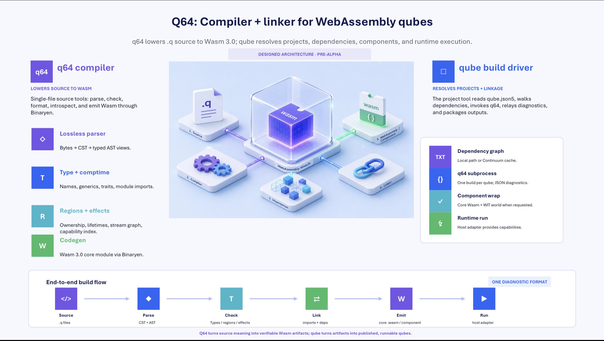

# q64

A stream-first language for Wasm 3.0, with managed and unmanaged memory as
first-class peers.



*The designed architecture at a glance: `q64` lowers `.q` source to Wasm 3.0;
`qube` resolves projects, dependencies, components, and runtime execution. See
[`ARCHITECTURE.md`](./ARCHITECTURE.md) for the full walkthrough.*

This repository is the q64 implementation monorepo. The language design
discussion that preceded the spec lived in the
[`q64-lang/design`](https://github.com/q64-lang/design) repo, now a tombstone
pointing here.

> **Status: pre-alpha.** Folders are scaffolded; most are not yet implemented.

## Layout

| Folder         | Purpose                                                                                       |
|----------------|-----------------------------------------------------------------------------------------------|
| [`continuum/`](./continuum) | Qube registry server (Cloudflare Workers; hosts qubes published from `qube publish`) |
| [`examples/`](./examples)   | Sample qubes (voice-agent, audio DSP, 3D demo)                                       |
| [`q64/`](./q64)             | Zig project → `q64` binary — the language tool (`fmt`, `lsp`, `show`, single-file)   |
| [`qube/`](./qube)           | Zig project → `qube` binary — the package and build tool                             |
| [`runtime/`](./runtime)     | Host adapters: `browser/`, `wasmtime/`, `wasmer/`, `audio-host/`                     |
| [`spec/`](./spec)           | Formal language spec and conformance tests                                           |
| [`stdlib/`](./stdlib)       | q64 standard library workspace (`math`, `anim`, `ai`, `net`, `audio`, `gfx`, `video`, `fs`) |
| [`web/`](./web)             | q64.dev site, registry UI, browser playground (Astro + Starlight; Cloudflare Pages)  |

## Vocabulary

- **qube** — the unit of distribution. A qube is what you publish, depend on, and
  import. It is described by a `qube.json5` manifest at its root.
- **continuum** — the qube registry. Where all qubes exist.
- **q64** — the language binary; operates on q64 source files.
- **qube** *(the binary)* — the package and build tool; operates on qube projects.

The CLI split mirrors `rustc` + `cargo`: `qube build` invokes `q64` internally,
the same way `cargo build` invokes `rustc`.

## Implementation languages

- **`q64/` and `qube/`** — written in **Zig**. Zig was chosen for: clean
  Binaryen C-API interop (the Wasm 3.0 emission path), excellent
  cross-compilation, tiny static binaries with no LLVM dependency, and
  cultural alignment with q64's comptime / explicit-allocator design.
- **`stdlib/`** — written in **q64** itself, compiled by the `q64` binary. The
  numeric primitives `Simd`, `Tensor`, and `DynTensor` are baked into the
  compiler as builtin types.
- **`runtime/<host>/`** — written in the **host's native language** (Zig for
  Wasmtime/Wasmer/audio-host adapters; TypeScript for the browser adapter).
- **`continuum/`** — **TypeScript** on Cloudflare Workers, using D1, R2, and
  KV.
- **`web/`** — **Astro + Starlight**. Starlight runs the docs; marketing
  pages are plain Astro routes; the playground and registry UI are Astro
  islands. The playground loads a wasm build of `q64/` to compile q64 source
  in the browser.

## Quickstart — hello world

From a fresh clone to `Hello, q64.` on stdout:

```bash
# 1. Install the pinned Zig + Binaryen + wasmtime toolchains into vendor/.
#    Re-runnable; skips work that's already done.
./init.sh

# 2. Put the pinned Zig on PATH for this shell.
. ./vendor/zig/activate

# 3. Build the three binaries the pipeline needs.
( cd q64               && zig build )    # → q64/zig-out/bin/q64
( cd qube              && zig build )    # → qube/zig-out/bin/qube
( cd runtime/wasmtime  && zig build )    # → runtime/wasmtime/zig-out/bin/q64-wasmtime-host

# 4. Run the example.
( cd examples/hello && ../../qube/zig-out/bin/qube run )
# → Hello, q64.
```

The example program in full (`examples/hello/hello.q`):

```
fn main {
    env.out("Hello, q64.")
}
```

`qube run` discovers `examples/hello/qube.json5`, calls `q64 emit` to
compile the source to wasm, then runs the wasm through the wasmtime
host adapter, which provides the `env.out` capability and invokes
`_start`.

For convenience, add the three binaries to PATH:

```bash
export PATH="$PWD/qube/zig-out/bin:$PWD/q64/zig-out/bin:$PWD/runtime/wasmtime/zig-out/bin:$PATH"
cd examples/hello && qube run
```

## Building

`init.sh` is re-runnable and skips work that's already done. Override
the pinned versions with `ZIG_VERSION=…`, `WASMTIME_VERSION=…`, or
`BINARYEN_VERSION=…`.

Binaryen is built from source by default (a few minutes). To skip that,
set `BINARYEN_CACHE_URL=<base>` and `init.sh` will fetch a prebuilt
`binaryen-<version>-<arch>-<os>.tar.gz` from that base, falling back to the
source build on any miss. The URL is supplied by the environment rather than
checked in here; ephemeral CI/web sessions point it at a prebuilt-lib cache.

The remaining bootstrap pieces (still in progress; folders are scaffolded):

- `qube build` will eventually walk `stdlib/` and compile each namespace
  qube to wasm. Today only the `examples/hello` qube round-trips.
- `cd web && pnpm install && pnpm dev` runs the site locally; the
  playground will pick up a wasm build of `q64/` from `web/public/` once
  that target is wired.

### Gotchas

- **`build.zig` lives in subprojects, not at the repo root.** Running
  `zig build` from the repo root fails with "no build.zig file found".
  `cd` into `q64/`, `qube/`, or `runtime/wasmtime/` first.
- **Use the pinned Zig, not a system install.** `build.zig` targets the
  version `init.sh` pins (0.16.0). A different Zig will fail with errors
  like `no field named 'root_source_file' in struct
  'Build.ExecutableOptions'`. After `. ./vendor/zig/activate`, verify with
  `which zig` — it should print `…/vendor/zig/zig`.
- **`init.sh` builds Binaryen from source** (a few minutes the first time).
  Parallelism is capped at `nproc - 1` to keep laptops responsive; override
  with `BINARYEN_JOBS=N ./init.sh`.

## Learn more

- [`ARCHITECTURE.md`](./ARCHITECTURE.md) — how a `.q` file becomes a running
  Wasm program: the compiler pipeline, the two-binary split, and the linker
  (the diagram at the top of this README, explained stage by stage).
- [`spec/`](./spec) — the formal language and CLI specs. When the spec and the
  code disagree, the spec wins.
- [`CLAUDE.md`](./CLAUDE.md) — repo conventions, chiefly the naming/casing
  rules (`Q64` vs `q64`, `Qube` vs `qube`, the Continuum).
- [`DEPLOYMENT.md`](./DEPLOYMENT.md) — maintainer runbook: how the web
  properties (q64.dev, docs.q64.dev) and the q64/qube binary releases ship.
  Contributors never need it — changes ship by PR.

## License

Dual-licensed under either of

- Apache License, Version 2.0 ([LICENSE-APACHE](LICENSE-APACHE))
- MIT license ([LICENSE-MIT](LICENSE-MIT))

at your option.

### Contribution

Unless you explicitly state otherwise, any contribution intentionally
submitted for inclusion in q64 by you, as defined in the Apache-2.0 license,
shall be dual licensed as above, without any additional terms or conditions.
